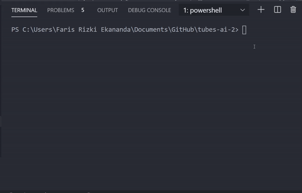
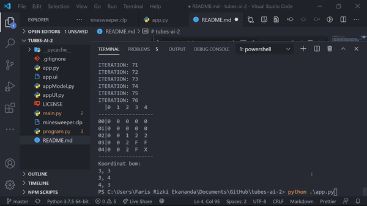

# tubes-ai-2
Tubes AI 2: CLIPS Exploration  

Program ini adalah program minesweeper AI yang dapat mencari solusi koordinat bom pada suatu permainan minesweeper. Program terbagi menjadi dua bagian yaitu mesin minesweeper yang memberikan AI kondisi dan nilai petak dari permainan minesweeper, dan program AI yang mencoba mencari solusi dari nilai petak yang diberikan oleh mesin minesweeper. Mesin minesweeper dibuat dalam bahasa Python sementara program AI dibuat dalam bahasa CLIPS.  

Berikut contoh demo program pada console  


Berikut contoh demo program pada GUI  


-------
## Requirements

- Python 3.x
- pyqt5 (for GUI version)
- clipspy

-------
## Usage

main.py > Minesweeper AI console version  
app.py > Minesweeper AI GUI version (unstable)

-------
### Run console version
Run in terminal:
```bash
python main.py
```
### Run GUI version
Run in terminal:
```bash
python app.py
```